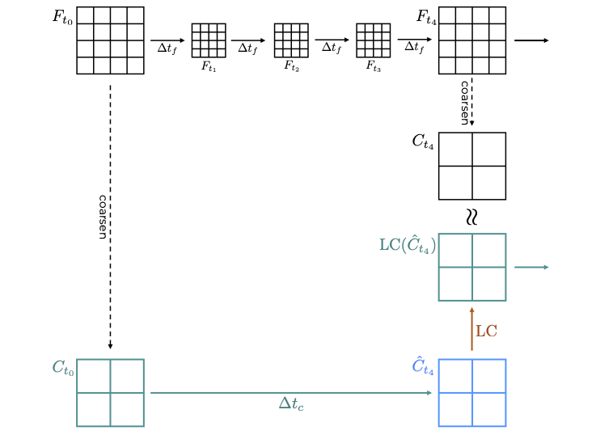

# Data generation and ML training - General Background

Both the data generation as well as the model construction and training is very problem specific. However, there are steps needed to create a useful model that are applicable more generally. This section interleaves the general principles with technical instructions to build a suitable ML model.

Often it is prohibitively expensive to model a physical system at the resolution needed to actually resolve the simulation faithfully. One possible way to reduce the required compute is to simulate the domain at lower resolution, however, such simulations diverge from the realistic system evolution very quickly. Therefore, we support the coarse-grain simulation with a trained ML model that ensures that the two simulations do not diverge significantly.

## Data Generation

The step-by-step workflow below describes the data generation process in general. You can also view a description of our [implementation](data-generation.md) for the example Hasegawa-Wakateani data generation process.

1. First, establish the suitable resolution (together with a suitable timestep taken by the solver), and the amount of coarsening you want to apply. In the examples used throughout this page, we use the domain of 1024x1024, and coarsen 4-times in both spatial directions, as well as in time.

2. Generate a "fully resolved" simulation (denoted F in the figure above).

3. Coarsen selected simulation snapshots; these will serve as input for each simulation step, and, if selected carefully, can be used also to calculate the correction needed for the ML training.

   _Note: It is important that the coarsening step generates files that can be used as an input to the simulation, rather than just coarsening the values in the field (eg by averaging or slicing the tensor). Have a look at our [implementation](data-generation.md) for inspiration._

4. From each coarsened simulation snapshot (denoted $C_{t_i}$ in the figure above), run one-coarse-step simulation using the solver and save the output; these represent $\hat{C}_{t_{i+1}}$.

5. Calculate the correction needed at each step by comparing $C_{t_m}$ with $\hat{C}_{t_m}$.

6. Consider augmentation techniques to introduce more variability to the dataset -- note that this step requires a good understanding of the underlying domain as not all augmentation techniques make sense for some problems. This step can be implemented at the dataset creation level, or as an additional funcitonality of a data loader that provides data to the ML training.

## ML training

It has been shown that CNN-like neural network architectures\[1\] are well suited to learn sub-grid scale information about fluid flows. The current model has few convolution layers and the output layer is equivalent in size to the input layer. Therefore, the model returns a field with matching dimensions to the workflow it was called from.

Using the data generated as described above, and after having decided on a specific neural network architecture, the training can commence. As every ML training, there are many adjustable hyperparameters, such as batch size or learning rate. It is advisable to test several different combinations to understand the impact the hyperparameters have on the time-to-solution and the solution's quality, and to explore early stopping\[2\].

Once the training concludes, the model needs to be exported in a format suitable for SmartSim, as it will be called by the orchestrator as part of the full workflow.

- Our implementation of ML training is described [here](training_implementation.md).

## References

[1] Kochkov, D., Smith, J.A., Alieva, A., Wang, Q., Brenner, M.P. and Hoyer, S., 2021. _Machine learning–accelerated computational fluid dynamics._ _Proceedings of the National Academy of Sciences_, _118_(21), p.e2101784118.

[2] [https://machinelearningmastery.com/how-to-stop-training-deep-neural-networks-at-the-right-time-using-early-stopping/](https://machinelearningmastery.com/how-to-stop-training-deep-neural-networks-at-the-right-time-using-early-stopping/), _accessed 13/05/2024_.

[< Back](./)
