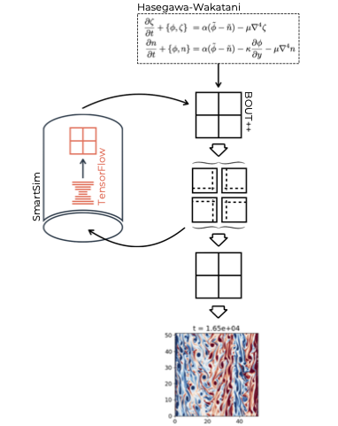

# SiMLInt

**SiMLInt is an [ExCALIBUR](https://excalibur.ac.uk/) project demonstrating how to integrate Machine Learning (ML) to physics simulations. It combines commonly used, open-source tools with in-house Python scripts to execute ML-aided computational fluid dynamics simulations.**

## Background

The SiMLInt workflow is currently based on Learned Correction\[1\] (LC):

The numerical solver is used to simulate a system, with adapted parameters so that the system is under-resolved due to the domain being decomposed to a coarser level than would be optimal. Beyond this, the execution of the simulation remains unchanged and can be parallelised as usual.

The coarse granularity of the domain decomposition means the simulation would diverge from the real evolution of the system. To prevent this, the workflow uses a pre-trained ML model to adjust the grid at every step of the simulation, keeping the system on the right track.

The ML model is often based on a convolutional neural network (CNN), and is trained to predict the difference between the coarse simulation step and a fully-resolved state, coarsened to match the grid dimensions. Notably, the workflow can be used in a parallelised scenario, where the the correction inference is performed in each parallel process separately, using the partial domain as the ML model's input, and using the model's prediction to correct only that slice.

The workflow is visualised in the diagram below. The numerical simulation (in our example, the fluid dynamics simulation code, BOUT++) is represented by the black squares and grids, while the Learned Correction loop (in our example, realised in SmartSim by calling a TensorFlow model) returns the correction (orange grid).

## Example Implementation

LC requires a model that is trained to predict the difference between the fully resolved trajectory that runs over a sufficiently fine resolution of the domain and a trajectory that uses coarser domain decomposition (and coarser time steps). To train such a ML model, we need to generate data matching this scenario, as detailed below.

The training dataset can be generated as follows:

1. Run a fully resolved simulation (denoted F)
2. Coarsen some timepoints on this fine trajectory (denoted C) -- these are *inputs* for the ML training
3. Make a coarse simulation step from C (denoted by the arrow labelled ∆t_c)
4. Calculate the difference between the fully resolved, coarsened grid and the coarse grid (denoted Ĉ) at the equivalent simulation step -- this is the *target* in the ML training

## Codes and Dependencies

The workflow consists of a simulation code implemented in a suitable domain solver, a trained ML model that supplements or adjusts part of the computation, and a layer that orchestrates the former two tools. We demonstrate the workflow on the Hasegawa-Wakatani set of equations. Users can test the setup using previously trained models provided. The dataset we have created for the Hasegawa-Wakatani example, based on 32,000 fully resolved points and, in the coarsened state prepared for the ML training, a size of roughly 32 GB. This is available on request.

Our example workflow uses the following tools:

* [BOUT++](https://boutproject.github.io), written in C++ and Python, as the fluid dynamics simulation code
* [TensorFlow](https://www.tensorflow.org/) (through [Keras](https://keras.io)) to develop, and train the ML model as well as for the ML inference
* [SmartSim](https://github.com/CrayLabs/SmartSim), using SmartRedis in-memory database, to handle the coordination and communication between the simulation code and the ML model

To reproduce our work, the system needs to have installed these tools in the [versions suitable for SmartSim](https://www.craylabs.org/docs/installation_instructions/basic.html#supported-versions).
For this step, it is best to follow the tool's installation instructions; however, we provide an example step-by-step and expected outcomes at each stage for installing these on [Cirrus](https://www.cirrus.ac.uk).

Instructions to recreate our implementation are linked below.

1. [> Cirrus Installation](./example-installation.md)
2. [> General Data Generation and ML Training](./ML_training.md)
3. [> SiMLInt Data Generation Implementation](./data-generation.md)
4. [> SiMLInt ML Training Implementation](./training_implementation.md)
5. [> SiMLInt Simulation](./inference.md)

SiMLInt Docker images have been built for [CPU](https://github.com/orgs/EPCCed/packages/container/package/simlint) (7.6 GB) and [GPU](https://github.com/orgs/EPCCed/packages/container/package/simlint-gpu) (17.1 GB). The CPU version can perform run BOUT++ Hasegawa-Wakatani simulations, generate ground-truth data, or run SiMLInt simulations with inference, while the GPU version is intended for use in training ML models (note: The [NVIDIA Container Toolkit](https://github.com/NVIDIA/nvidia-container-toolkit) is required to run CUDA images). For Docker container usage instructions, click [here](docker-images.md).

## References

[1] Kochkov, D., Smith, J.A., Alieva, A., Wang, Q., Brenner, M.P. and Hoyer, S., 2021. *Machine learning–accelerated computational fluid dynamics.* *Proceedings of the National Academy of Sciences*, *118*(21), p.e2101784118.
